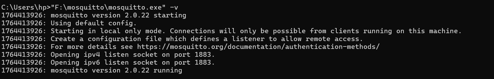
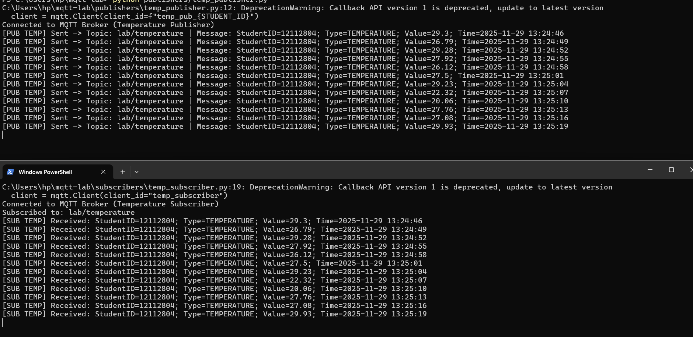
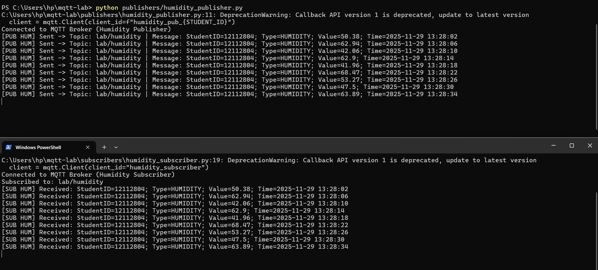
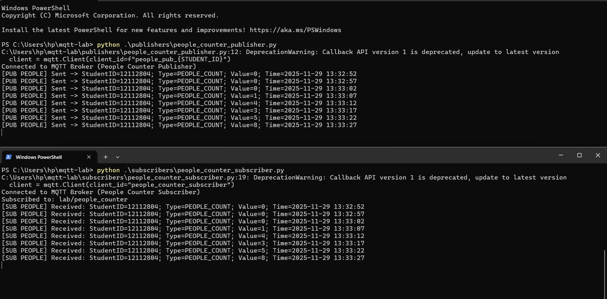

# MQTT Lab – Mosquitto Broker + Paho Clients

**Student ID:** 12112804  

This project demonstrates a full MQTT setup using:
- Mosquitto MQTT Broker
- Mosquitto MQTT Broker
- Three sensors (Temperature, Humidity, People Counter)
- Each message contains the student ID as required.

---

##  How the MQTT System Works

This lab demonstrates a complete MQTT workflow using **Mosquitto Broker** and **Paho-MQTT Python clients**.

### The workflow:

1. **Mosquitto Broker**  
   - Acts as the central message router.  
   - Runs locally on port **1883**.  
   - Publishers send messages to the broker.  
   - Subscribers receive messages from the broker based on topics.

2. **Sensors (Publishers)**  
   Three simulated sensors send data every few seconds:
   - Temperature Sensor → publishes to `lab/temperature`
   - Humidity Sensor → publishes to `lab/humidity`
   - People Counter Sensor → publishes to `lab/people_counter`

   Each published message includes:
   - Student ID (12112804)  
   - Sensor Type  
   - Random Value  
   - Timestamp  

3. **Subscribers**  
   A subscriber listens to a specific topic and prints all incoming messages in real time.

4. **Communication Flow Example**
Publisher → sends → Mosquitto Broker → delivers → Subscriber

5. **All components were tested together with screenshots included below.**

---

##  1. Mosquitto Broker Setup

Mosquitto was installed on Windows and verified to be running correctly.

###  Mosquitto Broker (Windows Service)
This shows the broker running as a Windows service.

###  Mosquitto Broker Running via Command Line
This confirms that Mosquitto is listening on port **1883**.

---

## 2. Temperature Sensor – Publisher & Subscriber

The temperature sensor publishes random temperature values (20°C–30°C)  
to the topic:

lab/temperature

Each message includes:
- Student ID  
- Sensor type (TEMPERATURE)  
- Value  
- Timestamp  

Below is a screenshot showing both the **publisher** and **subscriber** running together:

### Temperature Publisher + Subscriber

---

## 3. Humidity Sensor – Publisher & Subscriber

The humidity sensor publishes random humidity values (30%–70%)  
to the topic:

lab/humidity

Each message contains:
- Student ID  
- Sensor type (HUMIDITY)  
- Value  
- Timestamp  

Below is the screenshot showing both the **publisher** and **subscriber** running together:

### Humidity Publisher + Subscriber

---

##  4. People Counter Sensor – Publisher & Subscriber

The people counter sensor simulates counting the number of people in a room  
and publishes the value to the topic:

lab/people_counter

Each message contains:
- Student ID  
- Sensor type (PEOPLE_COUNT)  
- Value (0–10 simulated)
- Timestamp  

Below is the screenshot showing the **publisher** and **subscriber** working together:

###  People Counter Publisher + Subscriber

---

##  5. Project Structure

The project folder is organized as follows:

mqtt-lab/
│── publishers/
│ ├── temp_publisher.py
│ ├── humidity_publisher.py
│ └── people_counter_publisher.py
│
│── subscribers/
│ ├── temp_subscriber.py
│ ├── humidity_subscriber.py
│ └── people_counter_subscriber.py
│
│── screenshots/
│ ├── broker_running.png
│ ├── RuningMosqBroker.png
│ ├── temp_pubAndsub.png
│ ├── humidity_pubAndSub.png
└ └── people_count_pubAndSub.png

---

##  8. End of Lab

This lab demonstrates complete MQTT communication using:
- Mosquitto Broker  
- Paho MQTT Python publishers  
- Matching subscribers  
- Three simulated sensors (Temperature, Humidity, People Counter)

All components were successfully tested, and screenshots were taken  
to verify the correct flow of messages between publishers and subscribers.

**Student ID: 12112804**
